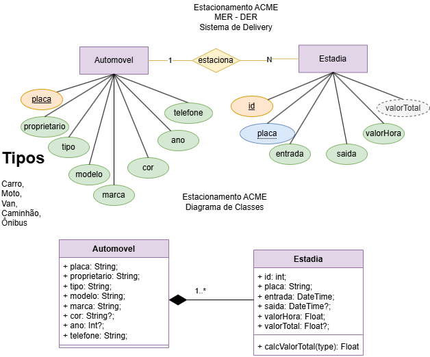
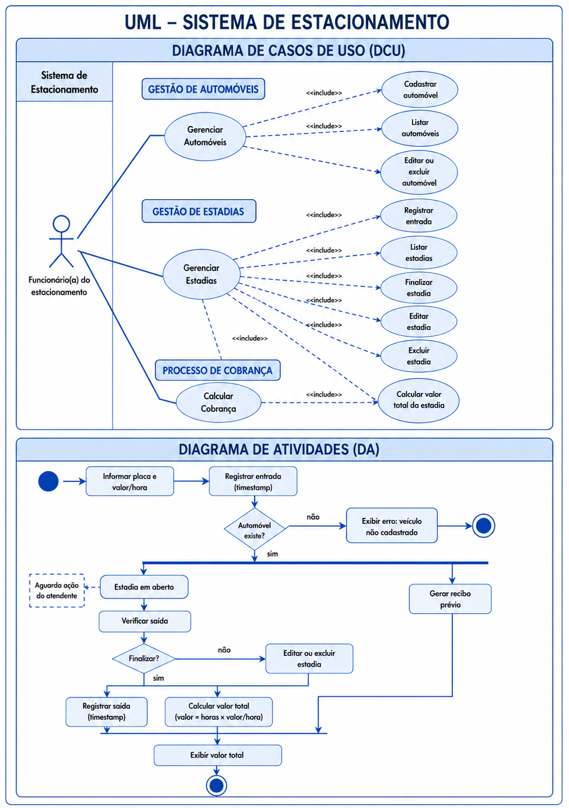

# 🚗 ESTACIONAMENTO ACME WEB

## 📌 Situação de Aprendizagem - Full-stack

Projeto desenvolvido utilizando tecnologias web para gerenciamento de estacionamento, permitindo cadastro de veículos, controle de estadias e cálculo automático de valores.

### 🛠️ Tecnologias Utilizadas

* Node.js
* Express
* Prisma ORM
* MySQL
* JavaScript
* HTML5
* CSS3
* VSCode
* Insomnia
* GitHub

---

# 🎨 Visual do Sistema

## 📋 Listagem de Veículos


## 📋 Listagem de Estadias


## 🚘 Cadastro de Veículo


## 🅿️ Cadastro de Estadia


---

# 📚 Documentação UML

## 📌 Diagrama de Classes (DC)



## 📌 Diagrama de Atividades (DA) e Casos de Uso (DCU)



---

# 📏 Regras de Negócio

* Todos os veículos devem estar cadastrados no banco de dados.
* O sistema será utilizado apenas pelo atendente.
* Cada estacionamento será registrado como uma estadia.
* A entrada deve ser gerada automaticamente.
* A saída e o valor total iniciam como nulos.
* O valor total será calculado automaticamente ao finalizar a estadia.

---

# ⚙️ Passo a Passo para Executar o Projeto

## 1️⃣ Clone o repositório

```bash
git clone https://github.com/toto20zin/senai-full-stack-estacionamento-2026.git
```

## 2️⃣ Instale as dependências

```bash
npm install
```

## 3️⃣ Configure o arquivo .env

Crie um arquivo `.env` na raiz do projeto:

```env
PORT=3000
DATABASE_URL="mysql://root@localhost:3306/estacionamento"
```

## 4️⃣ Execute as migrations do Prisma

```bash
npx prisma migrate dev
```

## 5️⃣ Inicie o servidor

```bash
npm run dev
```

O servidor estará disponível em:

```bash
http://localhost:3000
```

---

# 🌐 Abrir o Front-End

Abra o arquivo `index.html` diretamente no navegador
ou utilize a extensão **Live Server** no VS Code.

---

# 🚀 Como Utilizar o Sistema

## 🚘 Cadastro de Veículos

1. Abra o sistema no navegador.
2. Preencha os campos:

   * Placa
   * Proprietário
   * Modelo
   * Tipo
   * Marca
   * Telefone
3. Clique em **Cadastrar Veículo**.

---

## 🅿️ Registro de Estadia

1. Informe a placa de um veículo cadastrado.
2. Digite o valor cobrado por hora.
3. Clique em **Registrar Estadia**.

---

## ✅ Finalizar Estadia

1. Localize a estadia ativa.
2. Clique em **Finalizar**.
3. O sistema calculará automaticamente o valor total.

### 📐 Fórmula utilizada

```js
valorTotal = valorHora * (saida - entrada)
```

---

# ✨ Funcionalidades

* Cadastro de veículos
* Busca por placa
* Registro de entrada
* Registro de saída
* Cálculo automático de estadia
* Edição de registros
* Exclusão de registros
* Listagem de estadias
